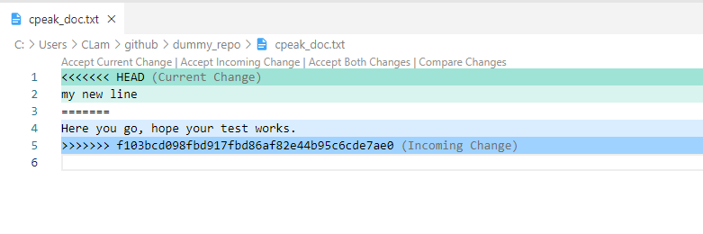
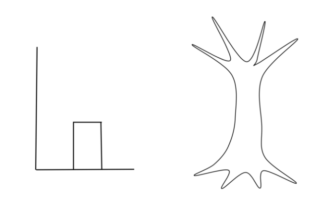
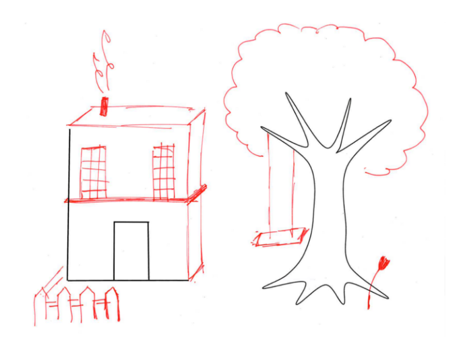
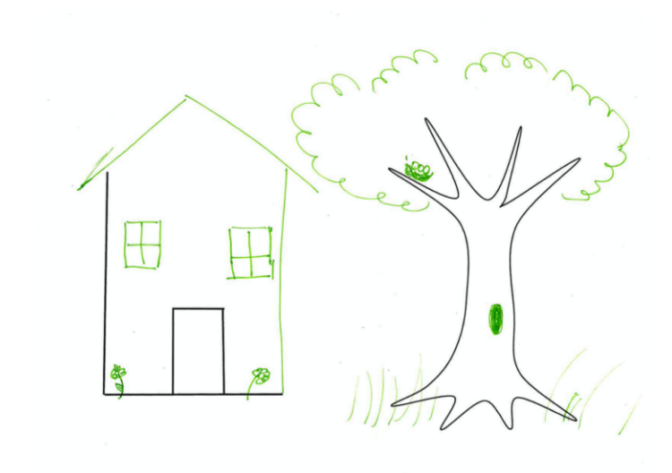
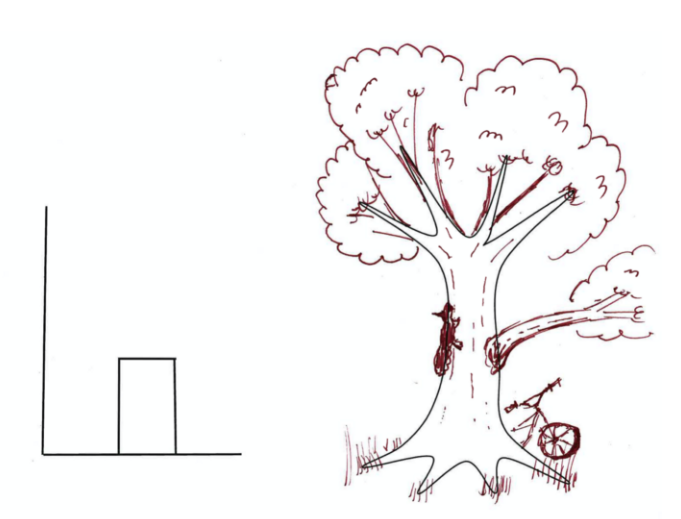
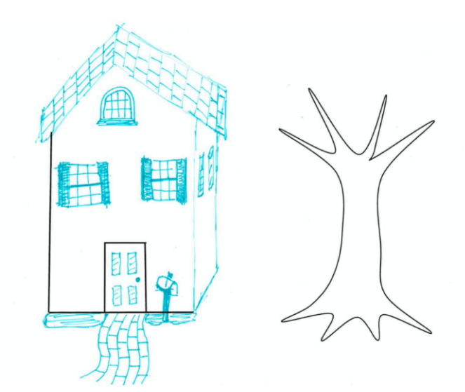
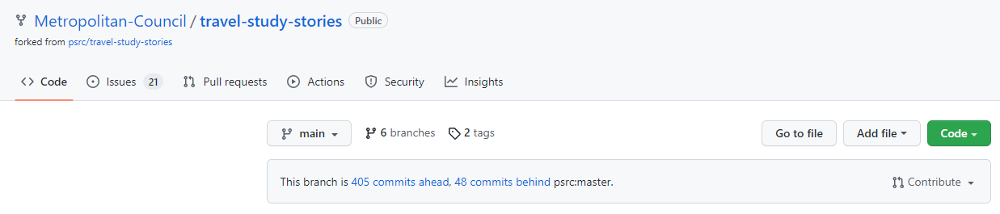

```{r xaringan-extra, echo=FALSE, warning=FALSE}
library(xaringanExtra)
library(emo)
use_tile_view()
use_panelset()
use_tachyons()

```

```{r setup, include=FALSE}
options(htmltools.dir.version = FALSE)
# 1. Merge conflicts 
# 2. Branching
# 3. Pull requests
# 4. Fork
# 5. Using the Terminal/Command Line
```

```{r xaringan-themer, include=FALSE, warning=FALSE}
library(xaringanthemer)
style_mono_accent(
  base_color = "#1c5253",
  header_font_google = google_font("Poppins"),
  text_font_google   = google_font("Poppins", "300", "300i"),
  code_font_google   = google_font("Fira Mono")
)
```
# Topics

.bg-near-white.b--gray.ba.bw2.br3.shadow-5.ph4[
Merge conflicts
]

.bg-near-white.b--gray.ba.bw2.br3.shadow-5.ph4.mt2[

Branching
]

.bg-near-white.b--gray.ba.bw2.br3.shadow-5.ph4.mt2[
Pull requests 
]

.bg-near-white.b--gray.ba.bw2.br3.shadow-5.ph4.mt2[
Forking 
]

--

.bg-near-green.b--green.ba.bw2.br3.shadow-5.ph4.mt2[
Github Desktop (local `r ji('computer')`) & Github (web/remote `r ji('cloud')`) 
]


---
class: inverse, center, middle

# Merge Conflicts

---


## Merge Conflicts

When do you encounter merge conflicts?

--

**.green[When things diverge and two people have changed the same lines in a file.]**

--
.pull-left.center[
`r ji('smiling face with sunglasses')` Developer A
]

.pull-right.center[
`r ji('nerd')` Developer B
]
--
.pull-left.center[
- Scripting (lines 1-10) `r ji('computer')`
]

.pull-right.center[
- Scripting (lines 1-10) `r ji('computer')`
]
--
.pull-left.center[

- Scripting `r ji('computer')` / Coffee break `r ji('coffee')`                

]

.pull-right.center[

- Commits & pushes to Github `r ji('up arrow')`

]
--
.pull-left.center[

- Commits & tries to push to Github `r ji('up arrow')`   
(Forgot to pull, pulls after the fact)                

]

.pull-right.center[


]

--


.pull-left.center[

- receives `r ji('warning')`. Need to resolve conflict.             

]

.pull-right.center[


]

--

Committing/Pushing when not in-sync with the latest commits on Github creates the divergence. 


---

## Resolving Conflicts


Github embeds **.green[conflict dividers]** in the file. The `=======` line is the "center" of the conflict. 

.mt5.center[

]

---

## Avoiding Conflicts

.panelset.sideways[

.panel[.panel-name[Github Desktop]

Notice the message indicating when there's new commits to the repo that require pulling

- Before working on your project, pull!

  - Click on `Fetch origin` button or 
  - Click the blue button in the middle of the screen 
]

.panel[.panel-name[Command Line]

If you're ready to add, commit, and push, but realized someone else has just pushed to the repo...

1. `git stash save` (removes the changes and sets them aside)

2. `git pull origin branch-name`

3. `git stash pop` (throw your changes back into the code)

4. `git add .`

5. `git commit -m 'your log message here'`

6. `git push origin branch-name`

]

]

---

## Avoiding Conflicts

Image and other related images by [Jeff Olson](https://medium.com/upperlinecode/teaching-git-github-to-teenagers-branching-and-merging-6416a365458a)

.bg-washed-blue.b--blue.ba.bw2.br3.shadow-5.flex.justify-center[

]
---

## Avoiding Conflicts

.bg-washed-green.b--green.ba.bw2.br3.shadow-5.ph4.mt5.flex.justify-around[

.div[

]

.div[

]
]

---

## Branches

.panelset.sideways[
.panel[.panel-name[Benefits]

- concurrent work on different parts of a project

- > Branches allow you to develop features, fix bugs, or safely experiment with new ideas in a contained area of your repository.

]

.panel[.panel-name[Image]
.bg-washed-yellow.b--yellow.ba.bw2.br3.shadow-5.ph4.flex.justify-around[

.div[

]

.div[

]
]
 
]

.panel[.panel-name[Github Desktop]

- Click on `Branch` > `New Branch`

.bg-near-green.b--green.ba.bw2.br3.shadow-5.ph4.mt2[
The new branch will be a copy of the branch that you were currently on.
]

]

.panel[.panel-name[Command Line]

- `git checkout -b name-of-new-branch`
  - Creates a new branch and moves you onto the branch.
  
- `git branch name-of-new-branch`
  - Creates a new branch only.
  
- `git branch`
  - Lists all branches in the repo. `*` indicates which branch you're on.
  
- `git checkout name-of-existing-branch`
  - Moves you onto branch.

]
]


---

## Pull Requests

- Notifying collaborators that you want to merge branches

- Creating a PR doesn't merge, just notifies and analyzes for conflicts 


---

## Fork

.panelset.sideways[
.panel[.panel-name[About]
> A fork is a copy of a repository. Forking a repository allows you to freely experiment with changes without affecting the original project.

- When the project diverges from the original intent

- A stepping-stone for your new project

- [Metropolitan Council (MN) forks PSRC's Travel Survey App](https://github.com/Metropolitan-Council/travel-study-stories)


]

.panel[.panel-name[Clone or Fork?]

Both copy a repository, but the purpose is different

.pull-left[
### Clone

- Creates a linked copy

- Contribute by pushing and pulling

]

.pull-right[
### Fork

- Creates an independent copy

- Contribute via PR

]
]

]
---

## Undo-ing

.panelset.sideways[
.panel[.panel-name[Github Desktop]

- After committing, click `Undo` 

]

.panel[.panel-name[Command Line]

- `Git reset HEAD dummy_file_01.R` (unstaging a file before a commit)

- `git checkout 36b761 dummy_file_01.R` (reverting a file to previous commit)

- `git checkout 36b761` (revert the whole repo to previous commit)

]
]


