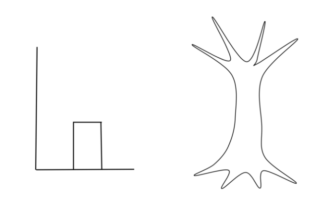
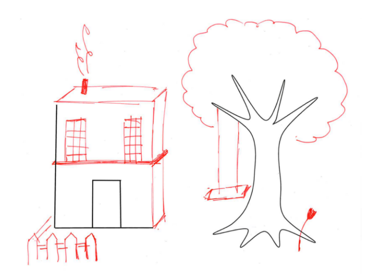
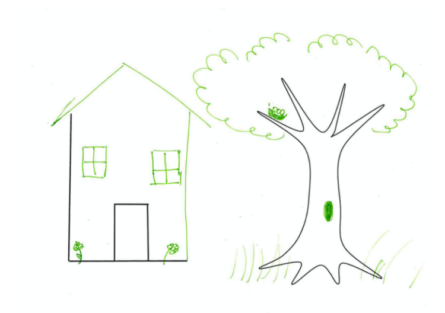

```{r xaringan-extra, echo=FALSE, warning=FALSE}
library(xaringanExtra)
use_tile_view()
use_panelset()
use_tachyons()

```

```{r setup, include=FALSE}
options(htmltools.dir.version = FALSE)
# 1. Merge conflicts 
# 2. Branching
# 3. Pull requests
# 4. Fork
# 5. Using the Terminal/Command Line
```

# Topics

.bg-near-white.b--gray.ba.bw2.br3.shadow-5.ph4[
Merge conflicts
]

.bg-near-white.b--gray.ba.bw2.br3.shadow-5.ph4.mt2[

Branching
]

.bg-near-white.b--gray.ba.bw2.br3.shadow-5.ph4.mt2[
Pull requests 
]

.bg-near-white.b--gray.ba.bw2.br3.shadow-5.ph4.mt2[
Fork 
]

--

Github Desktop (local) & Github (web/cloud/remote)


---
class: inverse, center, middle

# Merge Conflicts

---

## Merge Conflicts

Image by [Jeff Olson](https://medium.com/upperlinecode/teaching-git-github-to-teenagers-branching-and-merging-6416a365458a)

.bg-washed-blue.b--blue.ba.bw2.br3.shadow-5.flex.justify-center[

]
---

## Merge Conflicts

.bg-washed-green.b--green.ba.bw2.br3.shadow-5.ph4.mt5.flex.justify-around[

.div[

]

.div[

]
]

.footnote[
Images from Jeff Olson's Medium [article](https://medium.com/upperlinecode/teaching-git-github-to-teenagers-branching-and-merging-6416a365458a)
]
---

## Merge Conflicts

When do you encounter merge conflicts?

--
- When two people have changed the same lines in a file.

--


- Chances are higher for merge conflicts when 1) I'm changing the same lines in a file as someone else AND 2) forgetting to `git pull` (click on the `fetch origin` button) before changing a file and pushing.

--

Resolving conflicts


- Github embeds "conflict dividers" in the file. The `=======` line is the "center" of the conflict. 

---

## Branches

.panelset.sideways[
.panel[.panel-name[Image]
.bg-washed-yellow.b--yellow.ba.bw2.br3.shadow-5.ph4.flex.justify-around[

.div[

]

.div[

]
]
 
]

.panel[.panel-name[Github Desktop]

- Click on `Branch` > `New Branch`

]

.panel[.panel-name[Command Line]

- `git checkout -b name-of-new-branch`

]
]


---

## Pull Requests

- Notifying collaborators that you want to merge branches

- Creating a PR doesn't merge, just notifies and analyzes for conflicts 


---

## Fork

> A fork is a copy of a repository. Forking a repository allows you to freely experiment with changes without affecting the original project.

- When the project diverges from the original intent

- A stepping-stone for your new project

- [Metropolitan Council (MN) forks PSRC's Travel Survey App](https://github.com/Metropolitan-Council/travel-study-stories)


---

## Undo-ing

.panelset.sideways[
.panel[.panel-name[Github Desktop]

- After committing, click `Undo` 

]

.panel[.panel-name[Command Line]

- `Git reset HEAD dummy_file_01.R` (unstaging a file before a commit)

- `git checkout 36b761 dummy_file_01.R` (reverting a file to previous commit)

- `git checkout 36b761` (revert the whole repo to previous commit)

]
]


